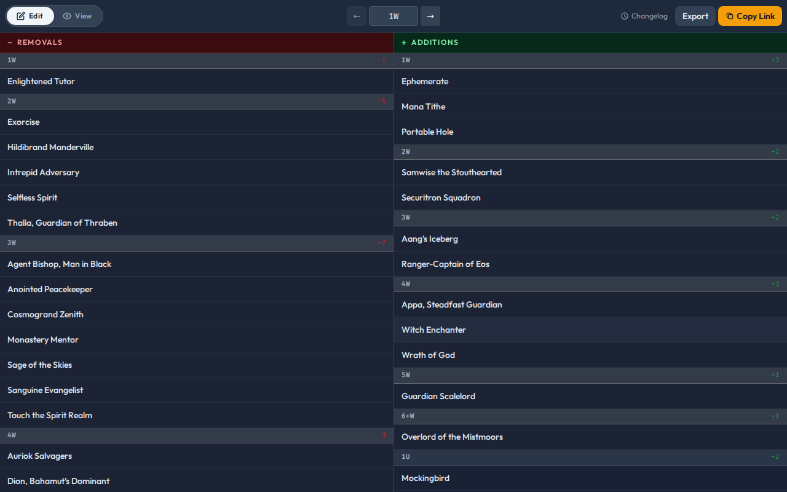
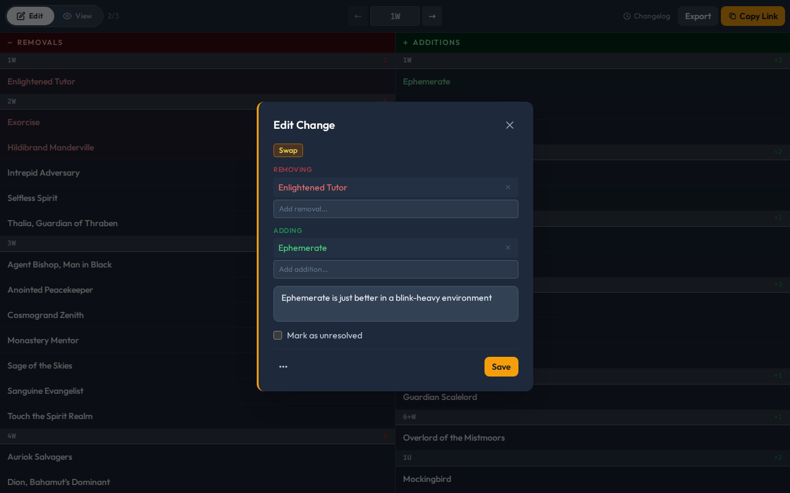
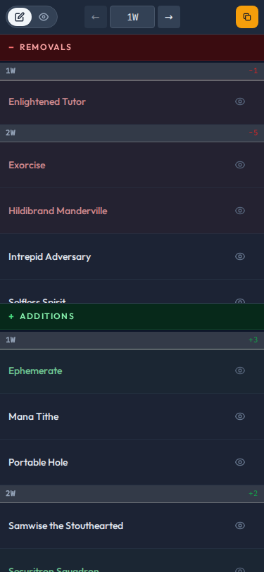

# Cube Merge

Collaborate and discuss cube updates with your playgroup.

A no-accounts-required shared workspace for comparing your cube to the latest set updates, proposing swaps, and hashing out cuts with your group. Think Google Docs for cube changes.

**[Try it live](https://cube-merge.pages.dev/?a=LSVCube&b=modovintage)** (LSV Vintage Cube vs MTGO Vintage Cube)

---

## How it works

1. **Paste two CubeCobra cube IDs** (or a compare URL) on the landing page
2. **Browse the diff** — cards grouped by color and CMC, removals on the left, additions on the right
3. **Select cards and propose changes** — swaps, adds, cuts, keeps, or rejects — with a note for your group
4. **Share the link** — everyone sees and edits the same session in real time



## Features

- **Real-time collaboration** — no sign-up, no accounts; share the link and go
- **Six change types** — swap, add, remove, keep, reject, and decline
- **Threaded comments** — discuss individual changes, @-mention reviewers, mark threads as resolved
- **Card previews** — hover for a quick look, tap to enlarge on mobile (powered by Scryfall)
- **Color breakdown** — see net adds/cuts per color at a glance
- **Export** — copy a plain-text summary, a CubeCobra-ready add/remove list, or a Proxxied print list
- **Session changelog** — every edit grouped by author and time, with full history
- **Branching** — fork a review from any set of sessions to explore a different direction
- **Mobile-friendly** — touch targets, stacked columns, and fullscreen card previews on phones

### Annotating changes



### Reviewing proposed changes


### Mobile



## Running locally

Requires [Bun](https://bun.sh) and a Firebase project with Firestore enabled.

```sh
bun install
cp .env.example .env   # fill in your Firebase credentials
bun dev
```

See `.env.example` for the required environment variables.

## Tech stack

Vite · React · TypeScript · Firebase Firestore · Tailwind CSS · Cloudflare Pages

Built with [Claude Code](https://claude.ai/code).
