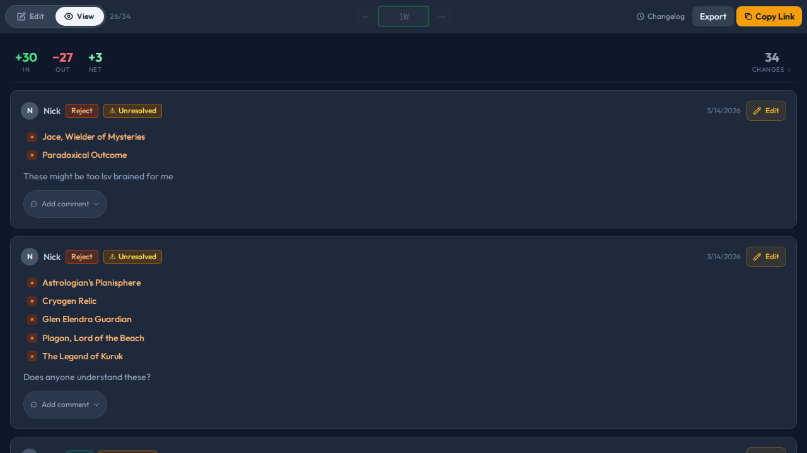

# Cube Merge

A collaborative review tool for Magic: The Gathering cube curators. Compare two cube lists side-by-side, annotate proposed changes, and work with your playgroup in real-time — no accounts required.


**[Try it live →](https://cube-merge.pages.dev)**

## How it works

1. **Paste two CubeCobra cube IDs** (or a compare URL) on the landing page
2. **See the diff** — cards are grouped by color and section, with removals on the left and additions on the right
3. **Select cards and propose changes** — swaps, adds, cuts, keeps, or rejects — and leave comments for your group
4. **Share the link** — everyone edits the same session live, no sign-up needed

## Features

- **Real-time collaboration** — anonymous, no sign-in; just share the link
- **Change types** — swap, add, remove, keep, reject
- **Comment threads** — discuss each change with your playgroup
- **Session changelog** — all work grouped by author and time, with full edit history
- **Branching** — fork a review from any set of sessions to continue in a new direction
- **Card image previews** — hover to preview, click to enlarge (Scryfall)
- **Export** — copy results as a summary or as CubeCobra-ready add/remove lists
- **Mobile-friendly** — works on phones and tablets



## Example review

**[→ See a real review in action](https://cube-merge.pages.dev/c/4zao1QMxNz)**

## Running locally

Requires [Bun](https://bun.sh) and your own Firebase project with Firestore enabled.

```sh
bun install
cp .env.example .env   # fill in your Firebase credentials
bun dev
```

See `.env.example` for the required environment variables.

## Tech stack

Vite · React · TypeScript · Firebase Firestore · Tailwind CSS · Cloudflare Pages

Built with [Claude Code](https://claude.ai/code).
